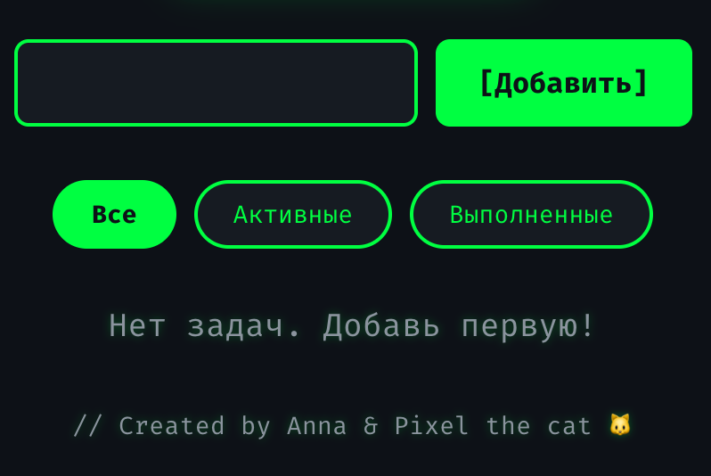
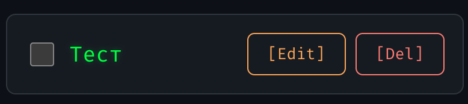
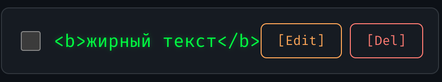

# Баг-репорты Task Manager

## BUG-001: Добавление задачи с пробелами

**Статус:** Closed (Not a bug)  
**Приоритет:** Medium  
**Серьёзность:** Minor  
**Окружение:**  
- OS: macOS  
- Browser: Chrome 120  
- URL: https://dazzling-hamster-1eccf4.netlify.app/

### Описание
Проверка валидации: приложение не должно позволять добавить задачу, состоящую только из пробелов.

### Шаги воспроизведения
1. Открыть приложение
2. В поле ввода ввести только пробелы (например, "   ")
3. Нажать кнопку "[Добавить]"

### Ожидаемый результат
Задача НЕ добавляется, так как не содержит видимого текста.

### Фактический результат
Задача НЕ добавляется. Валидация пробелов работает корректно. Баг не подтвердился.

### Вложения

---

## BUG-002: Редактирование задачи на пустой текст

**Статус:** Closed (Not a bug)  
**Приоритет:** High  
**Серьёзность:** Major  
**Окружение:**  
- OS: macOS  
- Browser: Chrome 120  
- URL: https://dazzling-hamster-1eccf4.netlify.app/

### Описание
Проверка валидации при редактировании: нельзя сохранить задачу с пустым текстом.

### Шаги воспроизведения
1. Добавить задачу с текстом "Тестовая задача"
2. Нажать кнопку "[Edit]" рядом с задачей
3. Удалить весь текст из поля ввода
4. Нажать кнопку "[OK]"

### Ожидаемый результат
Изменения НЕ сохраняются. Задача остаётся с исходным текстом.

### Фактический результат
Задача не сохраняется пустой. Текст остался прежним. Баг не подтвердился.

### Вложения

---

## BUG-003: Отсутствие валидации специальных символов (XSS)

**Статус:** Closed (Not a bug)  
**Приоритет:** Low  
**Серьёзность:** Minor  
**Окружение:**  
- OS: macOS  
- Browser: Chrome 120  
- URL: https://dazzling-hamster-1eccf4.netlify.app/

### Описание
Проверка безопасности: приложение должно экранировать HTML-теги и специальные символы.

### Шаги воспроизведения
1. Открыть приложение
2. В поле ввода ввести: `<b>жирный текст</b>`
3. Нажать кнопку "[Добавить]"

### Ожидаемый результат
Специальные символы экранируются и отображаются как обычный текст.

### Фактический результат
Текст отображается как `<b>жирный текст</b>`, HTML не рендерится. React автоматически защищает от XSS. Баг не подтвердился.

### Вложения
